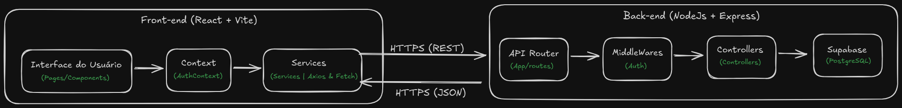

# oceanica-pescados 🐟

## Monorepo
O projeto, segue o padrão de **monorepositório**, usando **pnpm**, para gerenciar as depêncidas, e turbo.buid para uma Build mais rápida.

## Stacks
- FrontEnd: React + Vite + TailwindCSS
- Backend: NodeJS + Express
- Banco de Dados: PostgreSQL *Supabase*

## Padrões de Projeto
- Monorepo: Organização única para a Build rodar Front e Back.
- MVC > *backend*: Rotas, controle e lógica.
- Service Layer > *frontend*: Serviços intermediários para consumir a API

## Fluxo
